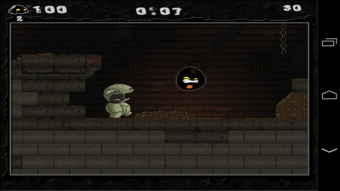
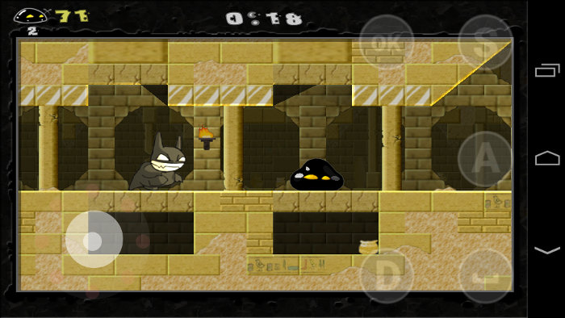
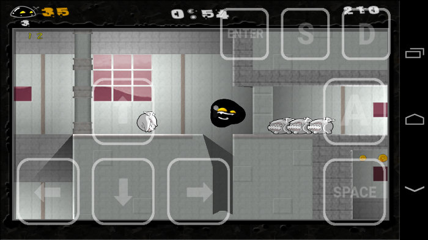

Gish
====

Gish is a side-scrolling platformer video game with some physics puzzle elements developed by Cryptic Sea (pseudonym of Alex Austin), Edmund McMillen, Josiah Pisciotta and published by Chronic Logic in 2004. The game was featured in the first Humble Indie Bundle in May 2010. Following the success of the Humble Bundle promotion, Cryptic Sea pledged to go open source with the game which eventually happened under the GPLv2 on May 29, 2010. - [Wikipedia](https://en.wikipedia.org/wiki/Gish_(video_game)).


This is my port of the Gish game to Android OS which uses SDL2, OpenAL and Ogg Vorbis libraries. In the port, you can select the rendering method through [GL4ES by ptitSeb](https://github.com/ptitSeb/gl4es) or OpenGL ES (thanks to the [Pickle](https://github.com/Pickle/GishGLES) for OpenGL ES renderer) libraries. I added touch controls developed by [SoD]Thor and some other improvements to the game engine.







[Gish port running on Motorola Photon Q, demonstration on YouTube](https://www.youtube.com/watch?v=GyMU2oV2LI4)

## Download

You can download APK-package for Android OS from the [releases](https://github.com/EXL/Gish/releases) section.

## Build instructions

For example, GNU/Linux:

* Install the latest [Android SDK](https://developer.android.com/sdk/) and [Android NDK](https://developer.android.com/ndk/);

* Clone repository into deploy directory;

```sh
cd ~/Deploy/
git clone https://github.com/EXL/Gish GishAndroid
```

* Build the APK-package into deploy directory with Gradle building script;

```sh
cd ~/Deploy/GishAndroid/
ANDROID_HOME="/opt/android-sdk/" ./gradlew assembleDebug
```

* Install Gish APK-package on your Android device via adb;

```sh
cd ~/Deploy/GishAndroid/
/opt/android-sdk/platform-tools/adb install -r gish/build/outputs/apk/gish-debug.apk
```
* Copy the purchased Gish game files to the Android device, read some info [here](assets_full/ReadMe-GishData.md);

* Run and enjoy!

You can open this project in Android Studio IDE also and build the APK-package by using this program.

## More information

Please read [Porting Guide (in Russian)](http://exlmoto.ru/gish-droid) for more information about porting Gish to Android OS.
